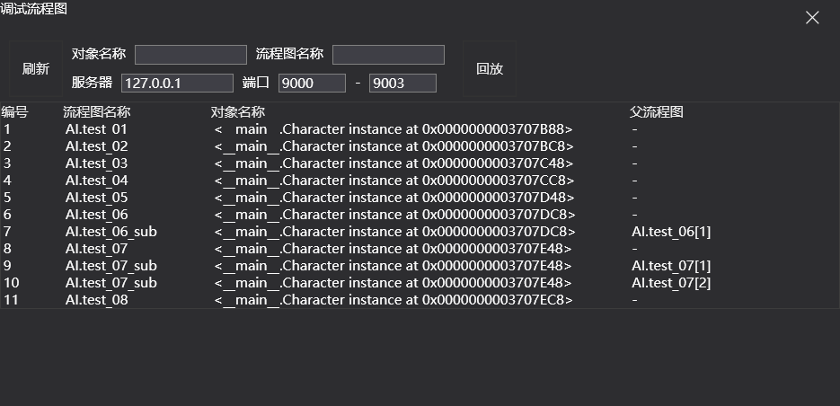
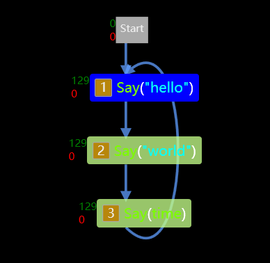

# 流程图的调试

流程图的调试功能用于帮助策划查看游戏中流程图的运行状态，包括当前游戏中运行的所有流程图实例，各个流程图中节点的状态与运行计数，流程图内部变量的实时数值等。

流程图的调试功能实现的原理是在工具与游戏中的Runtime之间建立一个网络连接。通过它，需要 Runtime 将游戏内部流程图的运行数据发送给工具。

!!! warning
    调试功能应仅在内部开发版本中启用，游戏的外网版本，特别是客户端中务必关闭调试功能。在 Runtime 中提供了一个编译开关，用于开启或关闭调试功能。

## 调试功能

### 调试窗口

单击工具栏中的调试按钮即可打开调试窗口，它的主要作用是获取游戏中满足条件的流程图信息。

需要设置的信息有游戏进程中 Runtime 使用的 IP 与端口范围。

!!! note
    一些游戏项目的 GM 工具也是通过指定端口来连接游戏的，请注意流程图调试使用的端口的与它们是不同。

设置好要调试的游戏进程的IP与端口之后，点击刷新按钮即可获取并显示游戏内运行的流程图列表，双击它们可对指定的流程图开始调试。

当游戏中运行的流程图数量太多时，可以在对话框界面设置一些过滤条件，包含对象的名称或是流程图的名称，以减少显示列表中的流程图数量。

### 快速调试

绝大多数情况下，使用者都是想对当前打开的流程图进行调试。为了方便操作，工具提供了快速调试的功能。

当点击工具栏中的快速调试按钮时，工具会自动连接当前调试窗口中配置的IP与端口的游戏进程，并获取游戏中当前流程图的运行信息。分两种情况：

- 游戏中当前流程图处于运行状态，那么就直接进入调试状态。如果有当前流程图有多个流程图处于运行状态，那么会调试获取到的第一条流程图信息
- 游戏中当前流程图没有运行，工具仍然会进入调试状态。之后一旦游戏中该流程图开始运行，就会立刻将流程图的运行信息发送给工具

!!! note
    流程图调试时显示的节点运行次数是从调试开始的时刻进行统计的。如果在流程图开始运行一段时间之后才进行调试，那么显示的计数会少于实际运行的次数。
    
    如需准确地统计各节点的运行数据，请在流程图运行之前，以快速调试的方式来进行调试。

### 调试信息

当流程图进入调试状态后，会在节点的左侧显示节点运行后返回 `True` 与 `False` 的计数。

同时节点背景的颜色对应着节点的运行状态：

- 蓝色：节点处于等待状态
- 绿色与红色：节点返回 `True` 或 `False`
- 无色：节点运行结束，变为空闲状态

而运行过程中流程图内部变量的实时数值也会显示在画布左侧的变量面板处。

### 断点功能

目前断点功能还处于实验阶段，可能存在一些 bug。当流程图处于调试状态时，可在节点上右键新建断点。当流程图运行到该节点时，该节点将不再继续运行，直到在节点上右键继续。

断点功能目前仅能在普通节点上设置，断点不会影响流程图其它分支上节点的运行。可以简单理解为断点就是在该节点前面加了一个无限时间的等待节点。

## 回放

流程图工具提供了对于调试过的流程图的数据进行回放的功能。每当工具栏中的停止调试按钮按下时，工具会自动将本次调试过程中收到的信息保存在工具目录下的的debug文件中。

点击调试窗口中的回放按钮，可以指定回放文件并列出其中包含的流程图信息，双击流程图即可进入该流程图的回放模式。

在回放模式下，流程图上方会出现一些回放的控制按钮，以及一个进度条。通过它们可以播放或跳转到相应的时刻来查看流程图的运行状态。

## 热更新

热更新是指策划在编辑流程图时，可以实时更新流程图到游戏进程中以查看效果。

热更新的操作十分简单，只需要点击工具栏中的热更新按钮，即可将当前流程图热更新到游戏中。热更新的时候，会自动停止并重新运行游戏中的该流程图。

## patch

流程图可以生成 patch 文件用于线上的补丁操作。(暂未实现)

patch 功能与热更新的原理类似，区别在于热更新功能是通过流程图工具，直接将patch数据发送给 runtime 进行更新。而 patch 则只负责生成 patch 文件，由游戏方来负责进行更新。