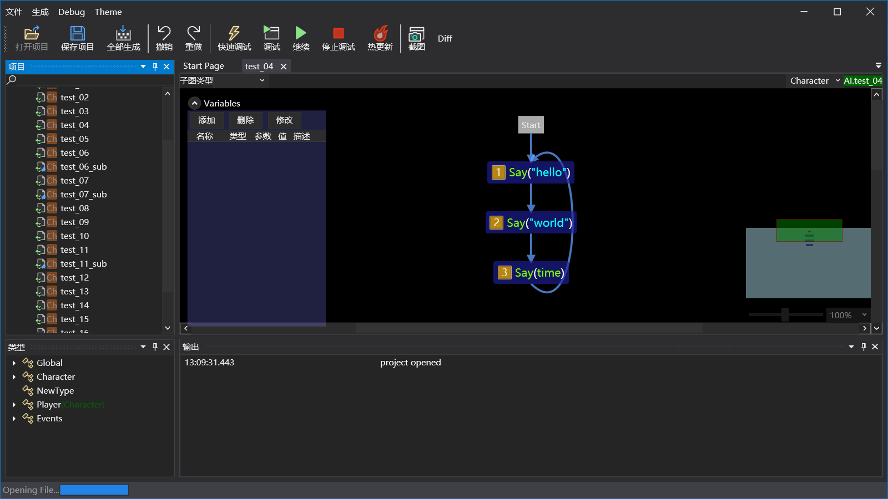

# AsyncFlow

AsyncFlow 是一个用于游戏中的AI与副本玩法开发的可视化编辑工具。它包含一个编辑器工具(以下简称工具)以及一个嵌入到游戏中运行的运行库(以下简称Runtime)。

## 流程图工具

### 运行环境依赖
流程图工具使用基于 c# 的 WPF 技术开发, 运行时依赖 .NET Desktop，如果电脑上之前没有安装过，在启动时会提示安装。

在工具目录中已经准备好了一个 `windowsdesktop-runtime-6.0.11-win-x64.exe` 文件，直接双击安装即可。也可以从微软的官方页面来下载[.NET Desktop Runtime](https://dotnet.microsoft.com/en-us/download/dotnet/thank-you/runtime-desktop-6.0.14-windows-x64-installer)

### 工具主界面

工具的主界面主要包括以下五个区域：

+ 菜单与工具栏：位于窗口的最上方
+ 项目面板：位于窗口的左侧，用于显示项目中的所有流程图
+ 类型面板：位于窗口的左下角，用于显示项目中可用的游戏类型和事件
+ 编辑区域：窗口中间最大的区域就是用来进行流程图编辑的区域
+ 输出窗口：在窗口的最下方，用来输出使用过程中的一些信息

## AsyncFlow Runtime

